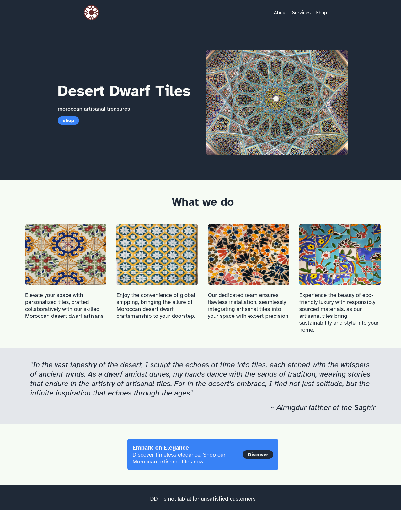

# odin-landing_page

## Description

In this project from "The Odin Project" i created a landing page  
made with **HTML** and **CSS** implementing my new learned **Flexbox** knowledge.

## Contents

- Landing page

## Links

- [live preview](https://bipbopbupdup.github.io/odin-landing_page/)

- link to the [Assignment](https://www.theodinproject.com/lessons/foundations-landing-page)

## Notes

Texts are all generated by chat.openai.com and serve only as an example
